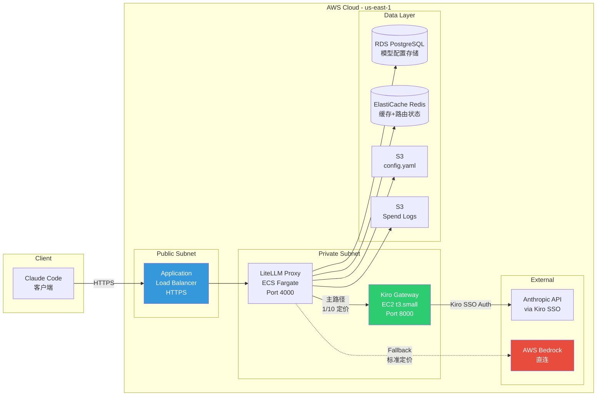
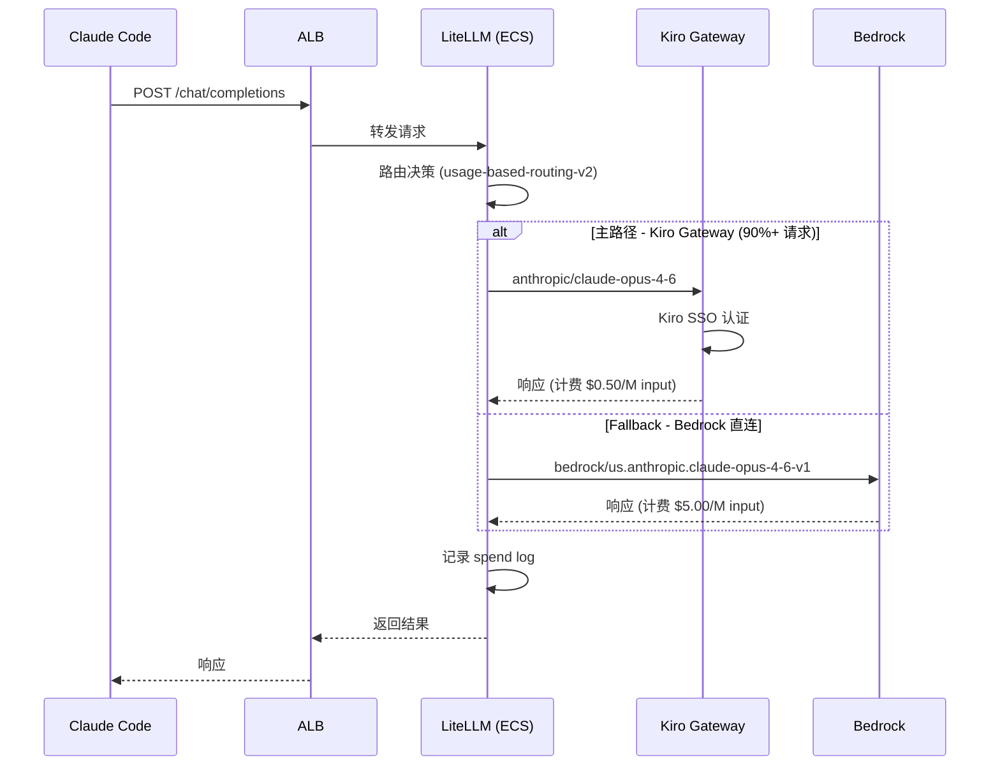
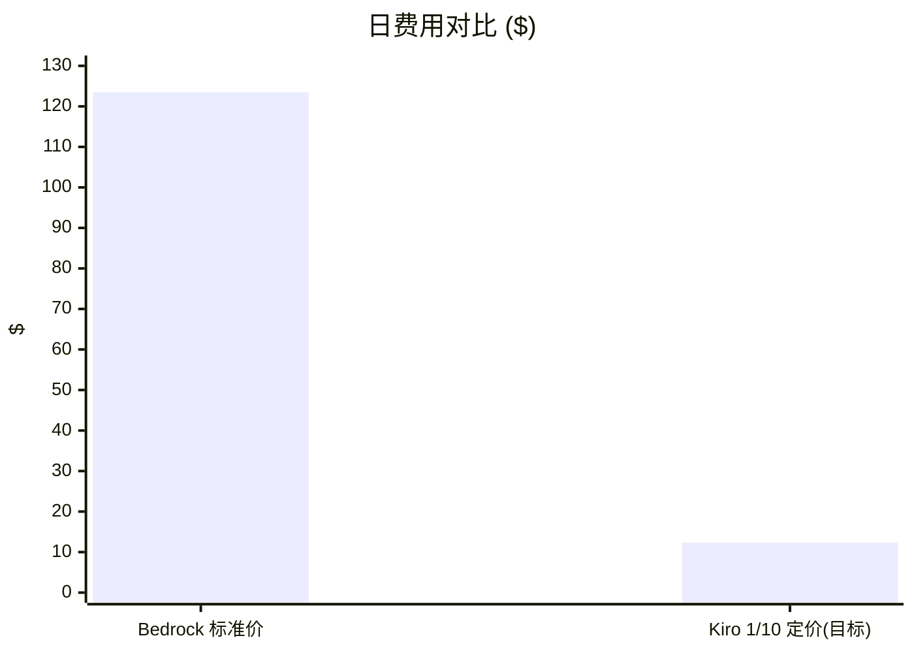
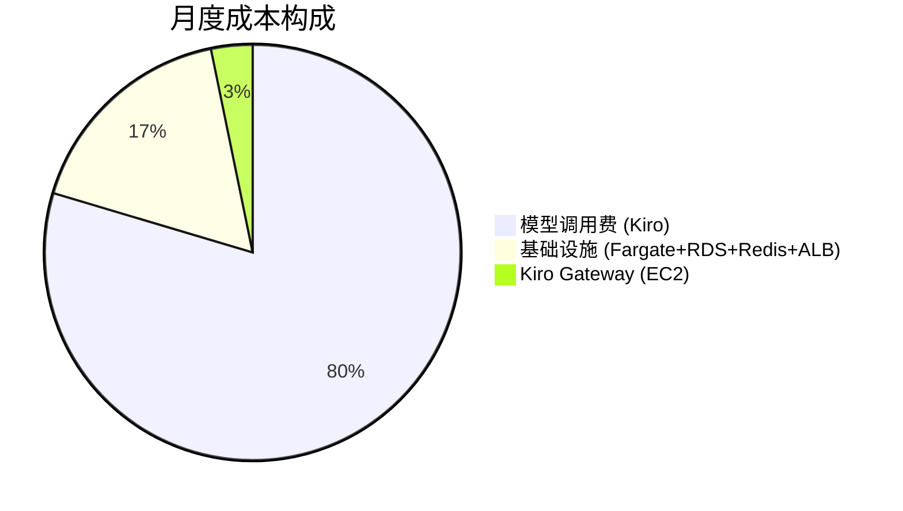
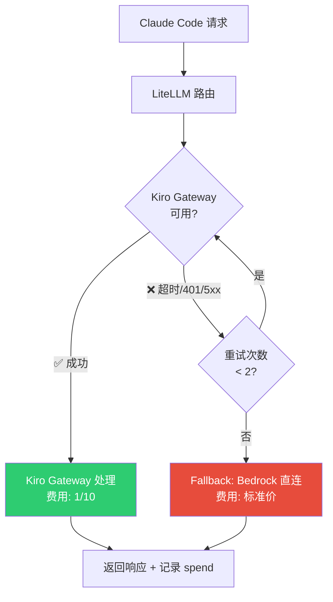

# 通过 LiteLLM + Kiro Gateway 实现 Claude Code 低成本接入

> **方案价值**：通过自建 LiteLLM 网关 + Kiro Gateway 反代架构，将 Claude Code 客户端的模型调用成本降低到 Bedrock 标准价的 **1/10**，同时保持高可用性（Bedrock 直连作为 fallback）。

## 方案成果

| 指标 | 数据 |
|------|------|
| 成本节省 | **87%**（vs Bedrock 标准价直连） |
| 月费用对比 | Kiro 方案 ~$466 vs Bedrock 直连 ~$3,704 |
| 月节省金额 | **~$3,238** |
| 日均调用 | ~389 次成功请求 |
| 高可用保障 | Bedrock 直连自动 fallback |
| 部署基础 | [AWS Solutions Library 参考架构](https://github.com/aws-solutions-library-samples/guidance-for-multi-provider-generative-ai-gateway-on-aws) |

---

## 架构设计

### 整体架构



### 请求流程



---

## 核心组件

### LiteLLM Proxy (ECS Fargate)

| 属性 | 值 |
|------|-----|
| 部署方式 | ECS Fargate |
| 配置来源 | S3 (config.yaml) |
| 模型存储 | PostgreSQL (`STORE_MODEL_IN_DB=True`) |
| 路由策略 | `usage-based-routing-v2` |
| Fallback 策略 | kiro → bedrock，最多 5 次 |
| 超时 | 6000 秒 |
| 重试 | 2 次 |

**关键配置 (config.yaml)：**
```yaml
general_settings:
  allow_requests_on_db_unavailable: True
  proxy_batch_write_at: 60

router_settings:
  routing_strategy: usage-based-routing-v2
  redis_host: os.environ/REDIS_HOST
  enable_pre_call_check: true

environment_variables:
  STORE_MODEL_IN_DB: 'True'

litellm_settings:
  cache: True
  callbacks: custom_callbacks.proxy_handler_instance
  success_callback: ["s3"]
  failure_callback: ["s3"]

model_list: []  # 所有模型在 DB 中管理
```

### Kiro Gateway (EC2)

| 属性 | 值 |
|------|-----|
| 实例类型 | t3.small |
| 服务 | systemd: kiro-gateway.service |
| 端口 | 8000 |
| 运行时 | Python 3.11 |
| 认证方式 | PROXY_API_KEY（入站）+ Kiro SSO（出站） |

**核心价值**：通过 Kiro SSO 认证获得 Anthropic API 的优惠定价（标准价的 1/10）。

### 模型配置

所有模型通过 LiteLLM `/model/new` API 存储在 PostgreSQL 数据库中：

| 模型名 | 后端 | 路径 | 定价 (input/output per token) |
|--------|------|------|------------------------------|
| kiro-claude-opus-4-6 | anthropic/claude-opus-4-6 | Kiro Gateway | 5e-07 / 2.5e-06 |
| kiro-claude-sonnet-4-6 | anthropic/claude-sonnet-4-6 | Kiro Gateway | 3e-07 / 1.5e-06 |
| bedrock-claude-opus-4-6 | bedrock/us.anthropic.claude-opus-4-6-v1 | Bedrock 直连 | 5e-06 / 2.5e-05 |
| bedrock-claude-sonnet-4-6 | bedrock/us.anthropic.claude-sonnet-4-6 | Bedrock 直连 | 3e-06 / 1.5e-05 |

**Fallback 链：**
```
kiro-claude-opus-4-6 → bedrock-claude-opus-4-6
kiro-claude-sonnet-4-6 → bedrock-claude-sonnet-4-6
```

**添加模型时的关键参数：**
```json
{
  "model_name": "kiro-claude-opus-4-6",
  "litellm_params": {
    "model": "anthropic/claude-opus-4-6",
    "api_base": "http://<KIRO_GATEWAY_IP>:8000",
    "api_key": "<KIRO_GATEWAY_API_KEY>",
    "input_cost_per_token": 5e-07,
    "output_cost_per_token": 2.5e-06
  },
  "model_info": {
    "custom_pricing": true,
    "input_cost_per_token": 5e-07,
    "output_cost_per_token": 2.5e-06
  }
}
```

> ⚠️ **必须同时设置** `litellm_params` 和 `model_info` 中的定价字段，且 `custom_pricing: true` 不可缺少（见"踩坑记录"）。

---

## 成本分析

### 定价对比

| 模型 | Kiro 路径 (1/10) | Bedrock 标准价 | 节省 |
|------|-----------------|---------------|------|
| Claude Opus 4 Input | $0.50/M tokens | $5.00/M tokens | 90% |
| Claude Opus 4 Output | $2.50/M tokens | $25.00/M tokens | 90% |
| Claude Sonnet 4 Input | $0.30/M tokens | $3.00/M tokens | 90% |
| Claude Sonnet 4 Output | $1.50/M tokens | $15.00/M tokens | 90% |

### 费用对比图



### 月度成本明细（修复后预估）

| 项目 | 月费用 |
|------|--------|
| 模型调用费 (Kiro 定价) | ~$371 |
| LiteLLM (Fargate) | ~$30 |
| Kiro Gateway (t3.small) | ~$15 |
| RDS PostgreSQL | ~$15 |
| ElastiCache Redis | ~$15 |
| ALB | ~$20 |
| **总计** | **~$466/月** |

对比纯 Bedrock 标准价 $3,704/月，**月度节省约 $3,238 (87%)**。



---

## Fallback 机制



**Fallback 触发条件：**
- Kiro Gateway 认证失败 (401)
- Kiro Gateway 超时 (>6000s)
- Kiro Gateway 服务不可用 (5xx)
- 上游 Anthropic API 错误

---

## 运维指南

### 日常监控

```bash
# 检查 Kiro Gateway 健康
curl -s http://<KIRO_GATEWAY_IP>:8000/health

# 检查 LiteLLM 健康 (通过 ALB)
curl -s https://<LITELLM_ALB_DOMAIN>/health

# 获取用量日志
curl -s "https://<LITELLM_ALB_DOMAIN>/spend/logs/v2?start_date=YYYY-MM-DDTHH:MM:SS&page_size=500" \
  -H "Authorization: Bearer <LITELLM_MASTER_KEY>"

# 查看模型配置
curl -s https://<LITELLM_ALB_DOMAIN>/model/info \
  -H "Authorization: Bearer <LITELLM_MASTER_KEY>"
```

### 模型配置变更

> ⚠️ ALB 对管理类 POST 请求返回 403，需通过 SSH 跳板直连 ECS task。

```bash
# 1. 获取 ECS task 私有 IP
TASK_ARN=$(aws ecs list-tasks --cluster litellm-stack-cluster \
  --service-name LiteLLMService --profile <PROFILE> --region us-east-1 \
  --query 'taskArns[0]' --output text)
TASK_IP=$(aws ecs describe-tasks --cluster litellm-stack-cluster \
  --tasks "$TASK_ARN" --profile <PROFILE> --region us-east-1 \
  --query 'tasks[0].attachments[0].details[?name==`privateIPv4Address`].value' --output text)

# 2. 通过跳板机操作
ssh -i <SSH_KEY>.pem ec2-user@<JUMP_HOST>

# 删除旧模型
curl -X POST "http://${TASK_IP}:4000/model/delete" \
  -H "Authorization: Bearer <LITELLM_MASTER_KEY>" \
  -H "Content-Type: application/json" \
  -d '{"id":"<model_id>"}'

# 添加新模型
curl -X POST "http://${TASK_IP}:4000/model/new" \
  -H "Authorization: Bearer <LITELLM_MASTER_KEY>" \
  -H "Content-Type: application/json" \
  -d '{"model_name":"kiro-claude-opus-4-6", "litellm_params": {...}, "model_info": {...}}'
```

### Kiro Gateway Token 刷新

Kiro Gateway 使用 SSO token 认证，位于：
```
/home/ec2-user/.aws/sso/cache/kiro-auth-token-cli.json
```

Token 过期时需重新认证：
```bash
ssh -i <SSH_KEY>.pem ec2-user@<JUMP_HOST>
# 检查 token 状态
cat /home/ec2-user/kiro-gateway/state.json
# 重启服务
sudo systemctl restart kiro-gateway
```

---

## 踩坑记录

本方案在实施和排障过程中遇到以下关键问题，记录于此供参考：

### 1. `custom_pricing` 必须显式设为 `true`

**现象**：模型配置了低价定价（5e-07），但 spend log 中出现标准价（5e-06）交替计费。

**根因**：当模型名匹配 LiteLLM 内置定价表时，如果未设置 `custom_pricing: true`，LiteLLM 会随机使用内置标准价替代自定义价。

**解决**：添加模型时必须在 `model_info` 中包含 `"custom_pricing": true`。

### 2. `api_key` 必须在 `litellm_params` 中显式传入

**现象**：所有请求 100% fallback 到 Bedrock，Kiro Gateway 从未被调用。

**根因**：Kiro Gateway 需要独立认证（`PROXY_API_KEY`），但模型配置中未传入 `api_key`。LiteLLM 使用环境变量 `ANTHROPIC_API_KEY`（值为 placeholder）→ Gateway 返回 401 → 静默 fallback 到 Bedrock。

**解决**：在 `litellm_params` 中必须包含 `"api_key": "<KIRO_GATEWAY_API_KEY>"`。

### 3. 定价叠加问题

**现象**：修复后出现 5.5e-06（= 5e-06 + 5e-07）的异常计费，比标准价还贵。

**根因**：当 fallback 触发时，主模型的 `custom_pricing` 值被叠加到 fallback 模型的标准价上。

**解决**：确保主路径正常工作（api_key 正确），避免触发 fallback。Fallback 应仅作为备份，非常态使用。

### 4. `/model/update` 对 DB 模型的 `custom_pricing` 无效

**现象**：调用 `/model/update` 后返回成功，但 `/model/info` 查询显示 `custom_pricing` 仍为 null。

**根因**：LiteLLM 的 `/model/update` 对某些字段更新不完整。

**解决**：使用 `delete` → `re-add`（`/model/delete` + `/model/new`）方式重建模型。

---

## 参考资源

| 资源 | 链接 |
|------|------|
| AWS 多供应商 GenAI 网关参考架构 | https://github.com/aws-solutions-library-samples/guidance-for-multi-provider-generative-ai-gateway-on-aws |
| LiteLLM 官方文档 | https://docs.litellm.ai/ |
| LiteLLM Custom Pricing 文档 | https://docs.litellm.ai/docs/proxy/custom_pricing |
| LiteLLM Fallback 配置 | https://docs.litellm.ai/docs/routing#fallbacks |

---

## 架构决策记录

| 决策 | 理由 |
|------|------|
| 使用 DB 存储模型而非 config.yaml | 支持运行时动态修改，无需重启 ECS |
| Kiro Gateway 单独 EC2 | 需要 SSO token 文件访问，Fargate 不支持 |
| Redis 缓存 | 路由状态共享、请求计数、限流 |
| S3 日志回调 | 持久化所有 spend logs 用于审计 |
| Fallback 到 Bedrock | 保证 Kiro Gateway 故障时服务不中断 |
| `custom_pricing: true` | 防止 LiteLLM 用内置价格表覆盖自定义定价 |
| `api_key` in litellm_params | Kiro Gateway 需要独立认证，不能用 env 变量 |

---

## License

MIT

---

*文档生成：2026-05-29 | 基于实际生产环境数据*
