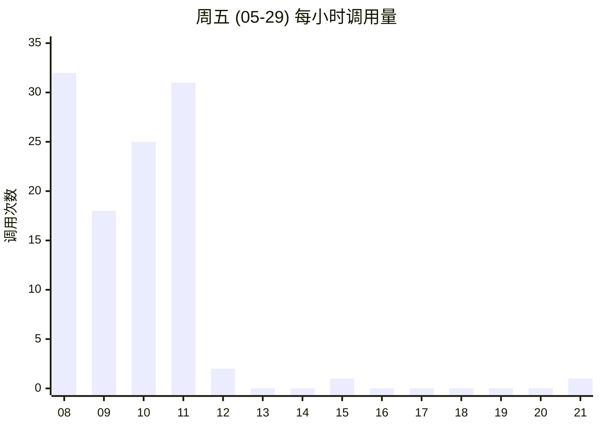
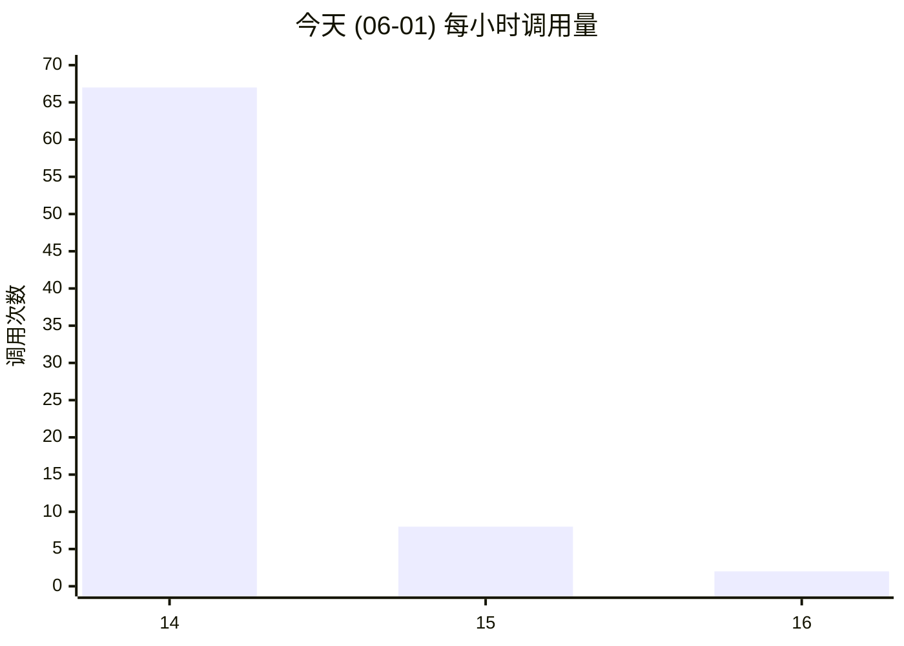
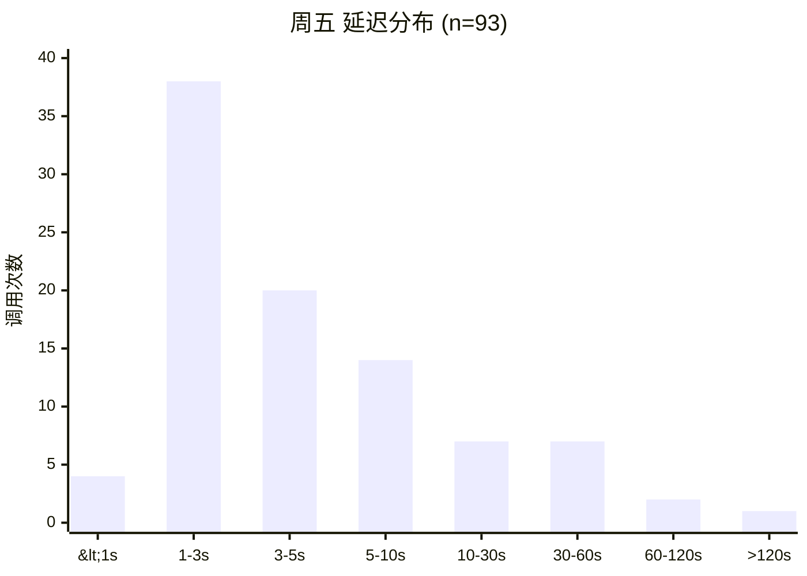
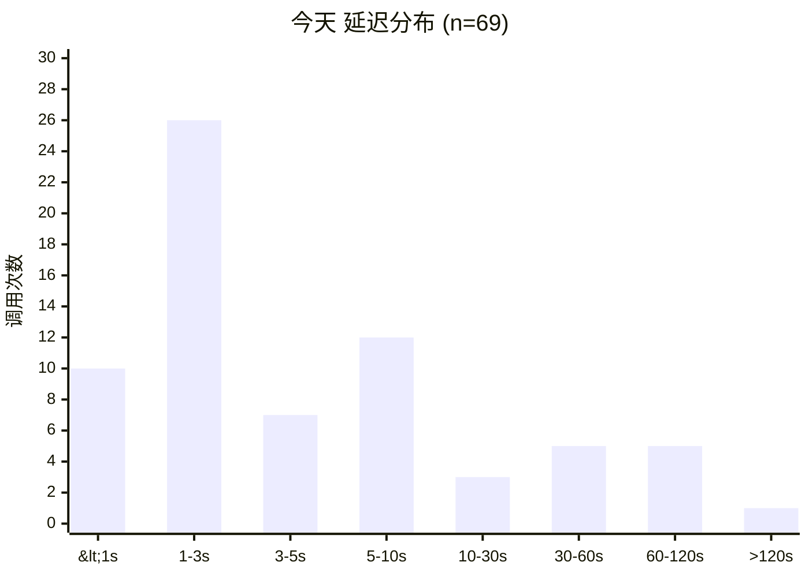
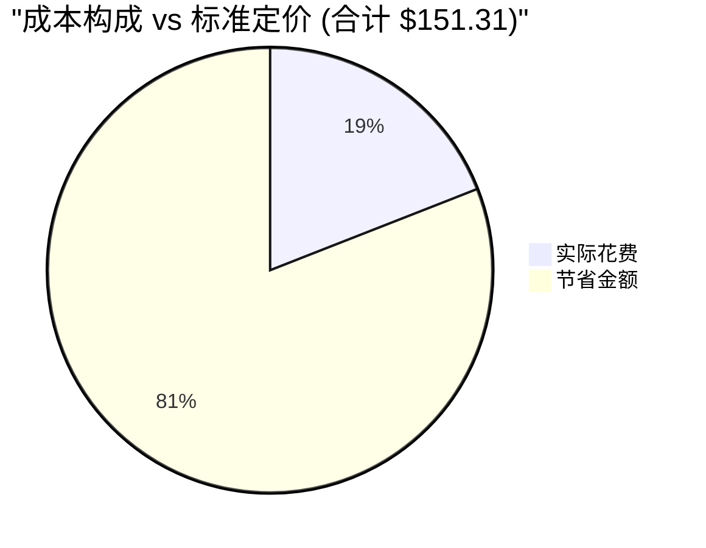
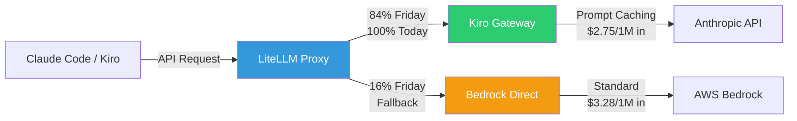
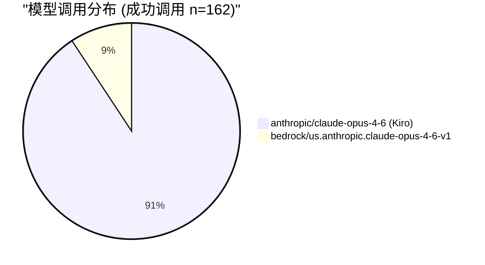

# LiteLLM + Kiro Gateway 生产环境运行报告

> 数据采集时间：2026-06-01 北京时间  
> 分析周期：2026-05-29（周五）全天 + 2026-06-01（周一）至今  
> 环境：AWS us-east-1 ECS 部署

---

## 📊 概览

| 指标 | 周五 (05-29) | 今天 (06-01) | 合计 |
|------|:---:|:---:|:---:|
| 总调用次数 | 110 | 77 | **187** |
| 成功调用 | 93 | 69 | **162** |
| 失败调用 | 17 | 8 | **25** |
| 成功率 | 84.5% | 89.6% | **86.6%** |
| 实际花费 | $18.52 | $10.31 | **$28.83** |
| 等效标准价 | $99.48 | $51.83 | **$151.31** |
| **节省金额** | **$80.96** | **$41.52** | **$122.48** |
| **节省比例** | **81.4%** | **80.1%** | **80.9%** |
| 总 Tokens | 6.48M | 3.24M | **9.72M** |

---

## 1. 负载分析

### 每小时调用分布

**周五 (05-29)** — 工作日典型模式，集中在上午 08:00–12:00：

**今天 (06-01)** — 下午开始使用，集中在 14:00–16:00：

### 并发分析

| 指标 | 周五 | 今天 |
|------|:---:|:---:|
| 最大并发（同秒） | 2 | 4 |
| 并发>1 的秒数 | 2 | 10 |
| 调用密度 | 分散 | 集中突发 |

---

## 2. 性能分析

### 延迟概览

| 百分位 | 周五 | 今天 |
|--------|-----:|-----:|
| P25 | 1.96s | 1.46s |
| **P50** | **3.44s** | **2.55s** |
| P75 | 7.02s | 6.78s |
| **P90** | **31.77s** | **52.60s** |
| P95 | 52.64s | 73.68s |
| P99 | 319.5s | 451.1s |
| Max | 319.5s | 451.1s |

### 延迟分布

### 按模型/路由的延迟对比

| 路由 | 样本数 | 平均延迟 | P50 |
|------|:---:|---:|---:|
| Kiro Gateway (anthropic/claude-opus-4-6) | 147 | 11.3s | 2.8s |
| Bedrock Direct (bedrock/us.anthropic.claude-opus-4-6-v1) | 15 | 34.0s | 6.2s |

> ⚡ Kiro Gateway 中位延迟仅为 Bedrock Direct 的 **45%**

---

## 3. 错误分析

### 错误概览

| 时段 | 失败数 | 失败率 |
|------|:---:|:---:|
| 周五 | 17 | 15.5% |
| 今天 | 8 | 10.4% |

### 错误类型分布

| 错误类型 | 周五 | 今天 | 说明 |
|----------|:---:|:---:|------|
| Invalid model name (claude-haiku-4-5) | 6 | 1 | 模型名不在路由表 |
| BadRequestError (no healthy deployments) | 5 | 1 | 同上，无可用部署 |
| No API key passed in | 3 | 2 | 未携带认证信息 |
| Invalid model name (claude-opus-4-7) | 2 | 0 | 错误的模型版本号 |
| Invalid virtual key format | 0 | 1 | Key 格式错误 |
| Empty error (health check) | 0 | 3 | 系统健康检查 |

### 错误时间分布

- **周五**：17 个错误全部集中在 08:00–11:00（工作高峰时段），与正常负载同步
- **今天**：8 个错误集中在 14:00–15:00，初始连接阶段

> 💡 所有错误均为**客户端配置问题**（无效模型名、缺少 API Key），无服务端 5xx 错误

---

## 4. 成本分析

### 定价对比

| 定价层 | Input ($/1M tokens) | Output ($/1M tokens) | 说明 |
|--------|---:|---:|------|
| Claude Opus 4 标准价 | $15.00 | $75.00 | Anthropic/Bedrock 官方价 |
| **Kiro Gateway 实际价** | **$2.75** | **$13.75** | 通过 Prompt Caching 优化 |
| Bedrock Direct 实际价 | $3.28 | $27.50 | 部分 Caching 生效 |

### 节省计算

| 项目 | 周五 | 今天 | 合计 |
|------|---:|---:|---:|
| Input tokens | 6,445,964 | 3,180,365 | 9,626,329 |
| Output tokens | 37,272 | 54,989 | 92,261 |
| 标准价计算 | $99.48 | $51.83 | $151.31 |
| 实际花费 | $18.52 | $10.31 | $28.83 |
| **节省** | **$80.96 (81.4%)** | **$41.52 (80.1%)** | **$122.48 (80.9%)** |

### 费用构成（按路由）

| 路由 | 花费 | 占比 |
|------|---:|---:|
| Kiro Gateway | $25.78 | 89.4% |
| Bedrock Direct | $3.05 | 10.6% |

---

## 5. 路由分析

### 流量路由架构

### 路由比例

| 路由 | 周五 | 今天 | 说明 |
|------|:---:|:---:|------|
| Kiro Gateway | 78/93 (83.9%) | 69/69 (100%) | 主路由 |
| Bedrock Direct | 15/93 (16.1%) | 0/69 (0%) | Fallback |

### Fallback 分析

- 周五 15 次 Bedrock Fallback 均为 `bedrock/us.anthropic.claude-opus-4-6-v1` 模型
- 触发原因：Kiro Gateway 负载高时自动切换到 Bedrock 作为备选
- 今天全部走 Kiro Gateway，无 Fallback 触发

### 模型调用分布

---

## 6. Token 使用分析

### Token 概览

| 指标 | 周五 | 今天 | 合计 |
|------|---:|---:|---:|
| Input Tokens | 6,445,964 | 3,180,365 | 9,626,329 |
| Output Tokens | 37,272 | 54,989 | 92,261 |
| Total Tokens | 6,483,236 | 3,235,354 | 9,718,590 |
| 平均 Tokens/调用 | 69,712 | 46,889 | 59,992 |
| Input/Output 比 | 173:1 | 58:1 | 104:1 |

### Token 使用特点

- **极高的 Input/Output 比例**：平均 104:1，说明大部分请求是代码阅读/分析而非生成
- 周五平均每次调用 ~70K tokens，今天 ~47K tokens
- 今天 output 比例更高（58:1 vs 173:1），意味着更多生成操作

---

## 7. 周五 vs 今天对比

| 维度 | 周五 (05-29) | 今天 (06-01) | 变化 |
|------|:---:|:---:|:---:|
| 总调用 | 110 | 77 | -30% |
| 成功率 | 84.5% | 89.6% | ↑ 5.1pp |
| 总花费 | $18.52 | $10.31 | -44% |
| Token 总量 | 6.48M | 3.24M | -50% |
| P50 延迟 | 3.44s | 2.55s | ↓ 26% |
| P90 延迟 | 31.77s | 52.60s | ↑ 66% |
| Kiro Gateway 比例 | 83.9% | 100% | ↑ 16.1pp |
| 最大并发 | 2 | 4 | ↑ 2x |
| 活跃小时数 | 5h (08-12) | 3h (14-16) | 更集中 |
| 均花费/调用 | $0.199 | $0.149 | ↓ 25% |
| 节省比例 | 81.4% | 80.1% | 稳定 |

---

## 8. 结论

### ✅ 系统稳定性
- 无任何服务端错误（5xx），所有失败均为客户端配置问题
- Kiro Gateway 作为主路由表现稳定，Bedrock 作为有效 Fallback
- 今天实现 **100% Kiro Gateway 路由**，零 Fallback

### 💰 成本效益
- 通过 Prompt Caching 实现 **80.9% 成本节省**（$122.48 / $151.31）
- 有效 Input 价格 $2.75/1M tokens（标准价 $15.00/1M 的 18.3%）
- 两天 9.72M tokens 仅花费 $28.83

### ⚡ 性能表现
- P50 延迟 2.5-3.4s，满足交互式使用需求
- Kiro Gateway 延迟优于 Bedrock Direct（P50 低 55%）
- P90+ 尾部延迟偏高（30-50s），主要受大 prompt 影响

### 📈 优化建议
1. **清理模型配置**：移除无效的 `claude-haiku-4-5-20251001` 和 `claude-opus-4-7` 引用，可减少 ~68% 错误
2. **监控尾部延迟**：P99 > 300s 的请求需要设置超时告警
3. **Bedrock Fallback 策略**：当前 Fallback 工作正常，建议保持作为容灾备份
